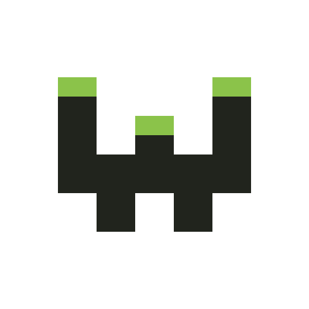

<div align="center">
<picture>
  
</picture>

[](https://github.com/LXGaming/webhook/blob/main/LICENSE)
[](https://hub.docker.com/r/lxgaming/webhook)
</div>

## Documentation
- [README](https://github.com/adnanh/webhook/blob/master/README.md)
- [Wiki](https://github.com/adnanh/webhook/wiki)

## Usage
### Docker Compose
```yaml
services:
  webhook:
    container_name: webhook
    image: lxgaming/webhook:latest
    ports:
      - 9000:9000/tcp
    restart: unless-stopped
    volumes:
      - ./config:/config:ro
```

### Docker
```shell
docker run -d \
  --name webhook \
  --publish 9000:9000/tcp \
  --restart unless-stopped \
  --volume ./config:/config:ro \
  lxgaming/webhook:latest
```

## Build
### Docker Compose
```shell
git clone https://github.com/LXGaming/webhook.git
cd webhook
docker compose up -d
```

### Docker (Alpine)
```shell
docker build --tag lxgaming/webhook:alpine --file .\alpine.Dockerfile --build-arg BRANCH=master .
```

### Docker (Debian)
```shell
docker build --tag lxgaming/webhook:latest --file .\Dockerfile --build-arg BRANCH=master .
```

## Credits
- [adnanh/webhook](https://github.com/adnanh/webhook)
- [TheCatLady/docker-webhook](https://github.com/TheCatLady/docker-webhook)

## License
webhook is licensed under the [Apache 2.0](https://github.com/LXGaming/webhook/blob/main/LICENSE) license.